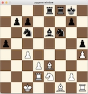

*Figure: Example of the chess AI demo in action*


## Simple Chess AI Demo

This project is a simple **AI vs. AI chess demo** built with Python and Pygame.  
The game automatically starts, and both sides are controlled by the computer using a basic **Minimax algorithm** with a simple evaluation function.  
It is designed for educational/demonstration purposes, not as a full-featured chess engine.

## Project Purpose
This repository was created as a learning record to practice Python, Pygame, and basic AI (Minimax).
It is not intended as a complete chess engine, but rather as a personal study project.


## Installation

1. Clone the repository:
```bash
git clone https://github.com/at-su-shi/chess.git
cd chess

2. (Optional) Create a virtual environment:
python3 -m venv venv
source venv/bin/activate   # Windows: venv\Scripts\activate

3. Install dependencies:
pip install -r requirements.txt


## Usage
Run the game with:
python3 chess_main.py

The game launches automatically, and the two AIs play against each other.
Messages are in English using the default Pygame font.
Piece images are included in the images/ folder.

## Known Limitations
No in-game restart/quit buttons
Close the window via the OS (the “X” button). To play again, re-run chess_main.py.
Draw rules are limited
Implemented: checkmate, stalemate
Not implemented: threefold repetition, fifty-move rule
As a result, the engine may keep repeating the same moves endlessly instead of declaring a draw.
No resignation
Since the game is AI vs. AI only, resignation is not part of the rules.
Simplistic AI
Minimax is implemented in a basic form for demonstration; no alpha–beta pruning or advanced evaluation.


## File Structure
chess/
├─ images/                    # Piece images
├─ chess_ai.py                # Minimax AI
├─ chess_ai_piece_scores.py   # Evaluation terms for Minimax
├─ chess_engine.py            # Board logic and rules
├─ chess_main.py              # Entry point
├─ requirements.txt
├─ README.md
└─ .gitignore

## License
This project is released under the MIT License.

### Third-party assets
- **Chess piece images**  
  By jurgenwesterhof (adapted from work of Cburnett) –  
  [Wikimedia Commons](http://commons.wikimedia.org/wiki/Template:SVG_chess_pieces),  
  Licensed under [CC BY-SA 3.0](https://creativecommons.org/licenses/by-sa/3.0/).

- **Fonts**  
  No proprietary fonts are bundled; the game uses the default Pygame font.
